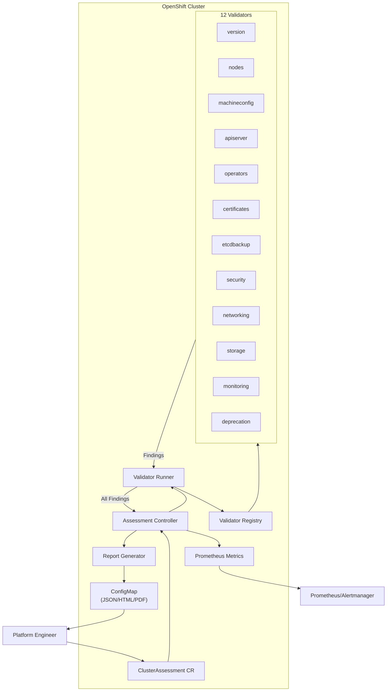
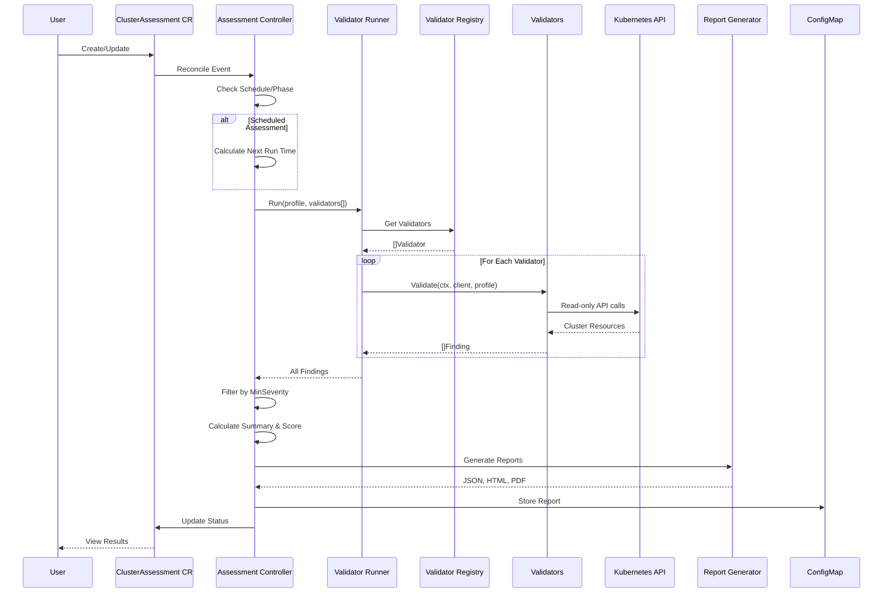
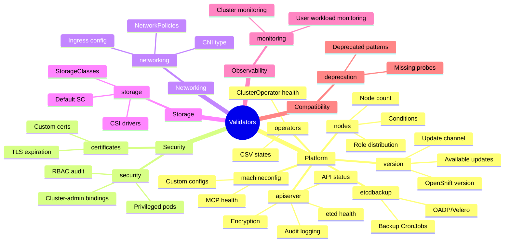
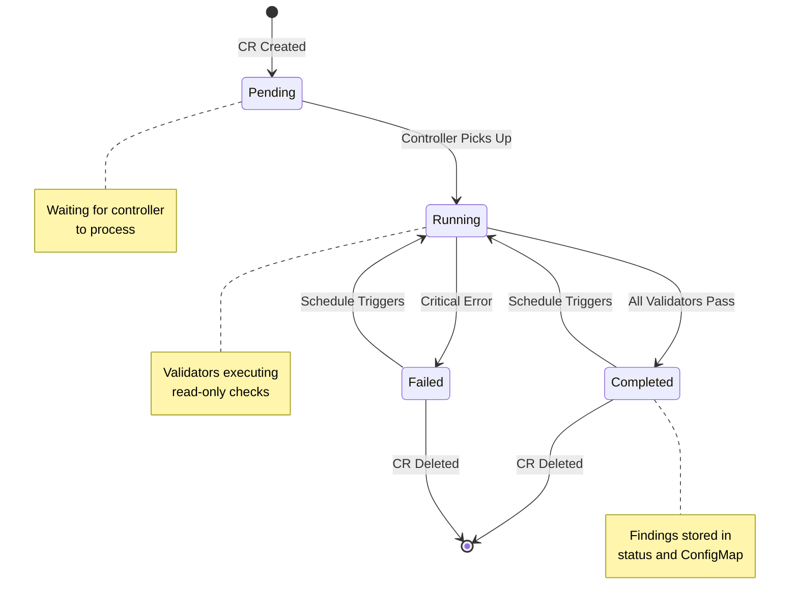
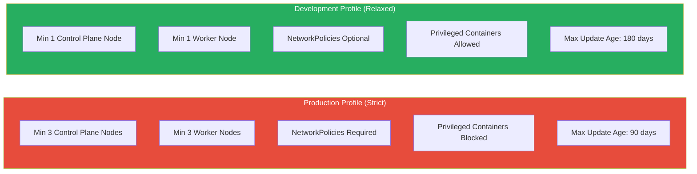
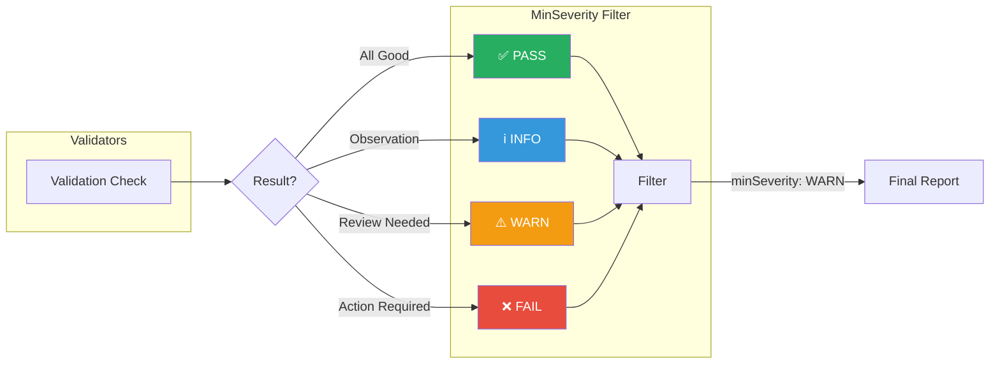
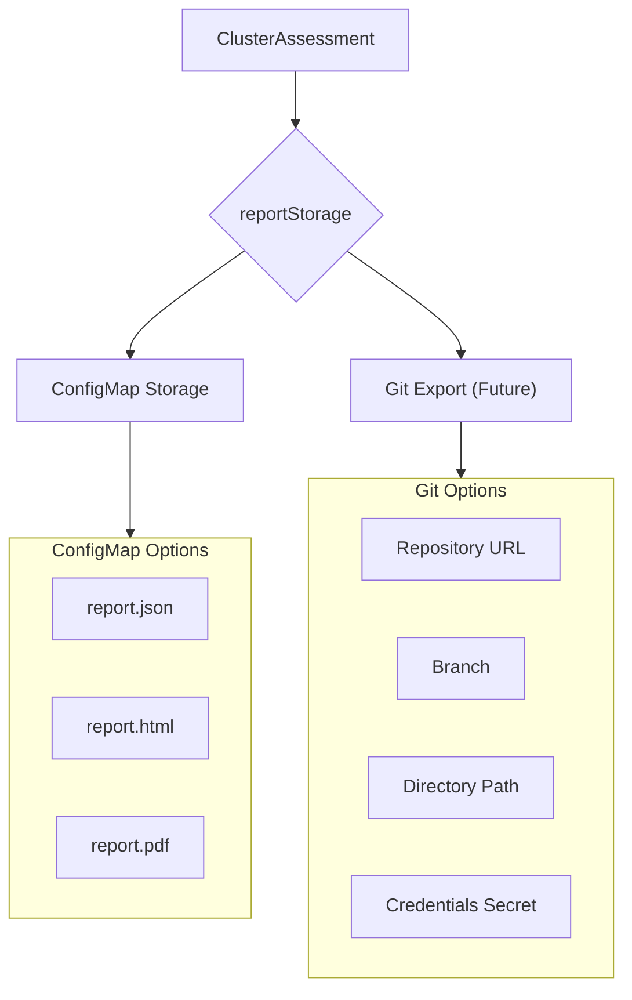
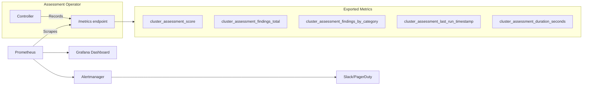
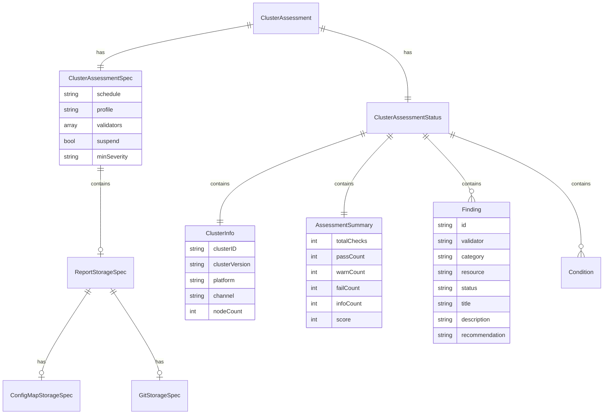
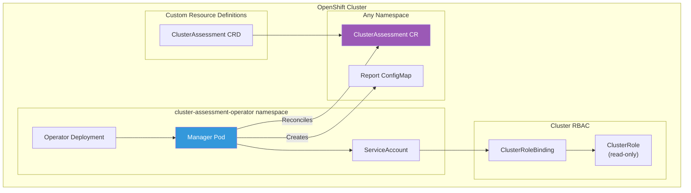

# Architecture Documentation

This document provides visual diagrams to help understand the internal architecture and workflows of the Cluster Assessment Operator.

## High-Level Architecture

## Component Interaction

## Validator Categories

## Assessment Lifecycle

## Profile Comparison

## Finding Severity Flow

## Report Storage Options

## Metrics Architecture

## Data Model

## Deployment Architecture

